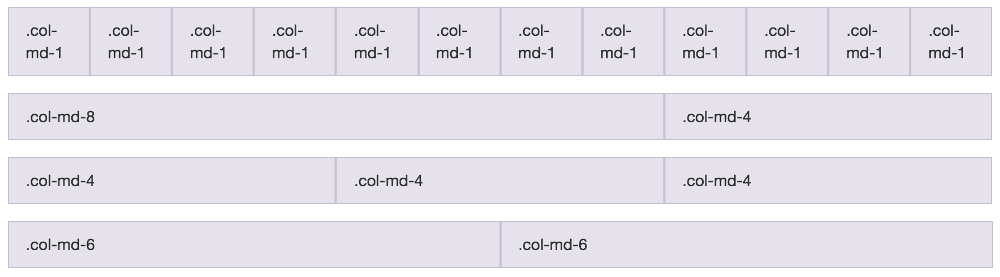

autoscale: true

# Intro to Programming

---

# Who am I?

## Esteban Pastorino (_a.k.a_ Kito)

### ejpastorino@gmail.com
### github.com/kitop | twitter.com/kitopastorino

---

# What we are going to cover

- Command line
- Git (and GitHub)
- HTML
- CSS
- JavaScript
- Ruby

---

# How to practice

- Personal projects
- Class project (ideally, something you can use at Honeypot)

---

# Rule #1:

# **Google is your friend**

---

# Rule #2:

# **Don't be afraid of documentation**

---

# Command Line

---

# Command Line

- **`ls`** - list files
  - **`ls -l -h -a`**
- **`cd <directory>`** - change directory
  - **`cd ..`** - go back one directory
- **`mkdir <directory>`** - make directory
- **`rmdir <directory>`** - remove an empty directory
- **`pwd`** - print working directory

---

# Command line

- **`touch <file>`** - create/update a file
- **`echo <something>`** - output something 
 - **`echo hello > foo.txt`** 
- **`cat <file>`** - show contents of a file
- **`rm <file>`** - remove a file

---

# Command Line

### Help!

- **`man <command>`** 
  - _e.g.:_ `man ls`
- **`<command> --help/-h`** 
  - _e.g.:_ `git --help`

---

# Git

---

# Git

- **`git init`**
- **`git status`**
- **`git add <file>`**
- **`git commit`** [-m, --amend]
- **`git log`** [-p]
- **`git rm <file>`**

---

# Git
- **`git config`** [--global]
- **`git clone`**
- **`git push`**
- **`git pull`** [--rebase]
- **`git help`**
- **`git help <command>`**

---

# Git

## Exercise

- Create a file
- View status, add the created file, commit
- View log
- Modify file
- Add, commit, view log
- Add another new file
- Remove first file
- Commit
- View Log

---

# Git

## Excercise

- Clone repo at https://github.com/kitop/intro-to-programming
- Go to repo
- View log
- Go to examples directory

---

# HTML
### HyperText Markup Language

---

# HTML

```html
<html>
  <head>
    <title>Hello, world!</title>
  </head>
  <body>
    <h1>Hello, World!</h1>
    <p>A website to greet the planet.</p>
  </body>
</html>
```

---

# HTML

## Structure

- Opening and closing tags (`<p>` and `</p>`)
- Nested elements
- Use 2 spaces!

---

# HTML

## Block Elements

- Headers (`<h1>`, `<h2>`, `<h3>`, `<h4>`, `<h5>`, `<h6>`)
- Paragraphs (`<p>`)
- Lists (`<ul>`, `<ol>`, `<li>`)
- Tables (`<table>`, `<tr>`, `<th>`, `<td>`)

---

# HTML
## Inline Elements

- Links (`<a>`)
- Strong (`<strong>`, `<b>`)
- Emphasis (`<em>`)
- Images (``) - Self closing!

---
## More Elements

- Line Breaks (`<br>`)
- Block container (`<div>`)
- Inline container (`<span>`)
- Forms (`<form>`, `<label>`, `<input />`, `<select>`, `<textarea>`)
- Code Formatting (`<code>`, `<pre>`)
- Quotes (`<q>`, `<blockquote>`)
- And more ([https://developer.mozilla.org/en-US/docs/Web/HTML/Element](https://developer.mozilla.org/en-US/docs/Web/HTML/Element))

---

# HTML

## Element Attributes

- `id`
- `class`
- `style`
- `href`
- `src`
- ...

---

# CSS
### Cascading Style Sheets

---

# CSS

```css
h1 {
  color: blue;
}

.error {
  color: red;
  border: 1px solid red;
}

#logo {
  margin: 10px;
}
```

---

# CSS

HTML `style` tag

```html
<head>
  ...
  <style>
    body {
      background: #EEE;
      font-family: sans-serif;
    }
    h1 { text-decoration: underline; }
  </style>
  ...
</head>
```

---

# CSS

To include a CSS file from HTML page:

```html
<head>
  ...
  <link href="./styles.css" rel="stylesheet" />
  ...
</head>
```

---

# Bootstrap

### http://getbootstrap.com/

---

# Bootstrap

## Grid System



---

# Bootstrap

## Grid System

```html
<div class="row">
  <div class="col-md-1">.col-md-1</div>
  <div class="col-md-1">.col-md-1</div>
  ...
</div>
<div class="row">
  <div class="col-md-8">.col-md-8</div>
  <div class="col-md-4">.col-md-4</div>
</div>
<div class="row">
  <div class="col-md-4">.col-md-4</div>
  <div class="col-md-4">.col-md-4</div>
  <div class="col-md-4">.col-md-4</div>
</div>
<div class="row">
  <div class="col-md-6">.col-md-6</div>
  <div class="col-md-6">.col-md-6</div>
</div>
```
---

# Bootstrap

## Components

---

# GitHub Pages

### https://pages.github.com/

--- 

# Homework
### Build a personal website

- Include:
  - Short bio
  - Some things you've worked on
  - Links to your twitter, linkedin, etc
  - Some pictures
- Extra points: 
  - More than one page
  - Hosted on GitHub pages


